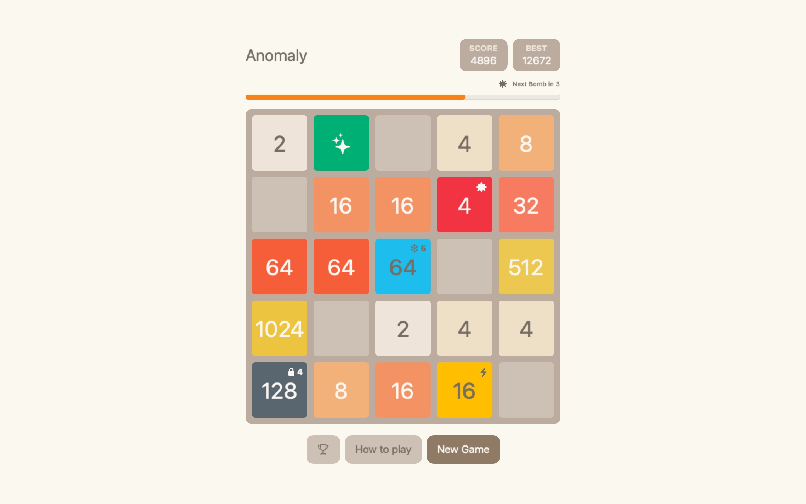

# Anomaly Merge
A number-merging strategy game with Classic and Anomaly modes.

Use swipe to move the tiles.
Tiles with the same number merge into one when they touch.
Merge equal tiles, manage the board, and master five special anomaly tiles.

### Requirements 
- iOS 15.0
- macOS 12.0
- tvOS 15.0

### Available in App Store
- [macOS](https://apps.apple.com/ru/app/2048-improved/id6448960426?l=en&mt=12)
